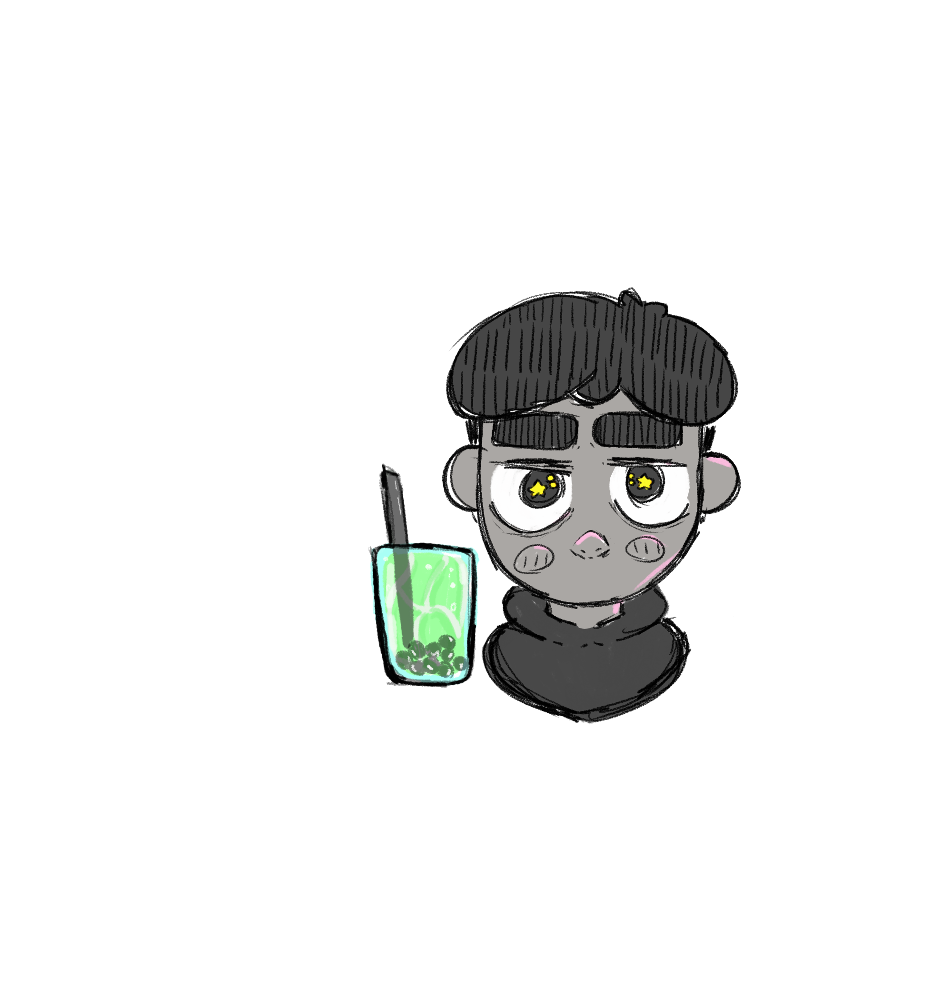

# titulo
## titulo h2
### titulo h3
#### titulo h4
##### titulo h5
###### titulo h6

<!-- italica-->
esto es un *italic* texto
<!-- strong-->
esto es un **strong**texto
<!-- tachado-->
esto es un  ~~texto~~ tachado
<!-- UL-->
* apple
    * apple 2
* orange
* etc

1. apple
2. orange
3. etc

<!-- Enlace a otras paginas-->
[imagen.com](https://mx.pinterest.com/ "imagen.jpg")

<!--citas-->
>this is una cita

<!-- Linea horizontal-->
---
___
`console.log('hola mundo')`
```c++
printf("andy palma hernandez");
```
|Table      |are        | cool      |
|-----------|:---------:|----------:|
|col 3 is   | hola      |   si      |
|col 2 is   |  andy     |   no      |
|zabrastrip |   mundo   |   and     |




<!-- GITHUB-->
* [x] Tarea 1   
